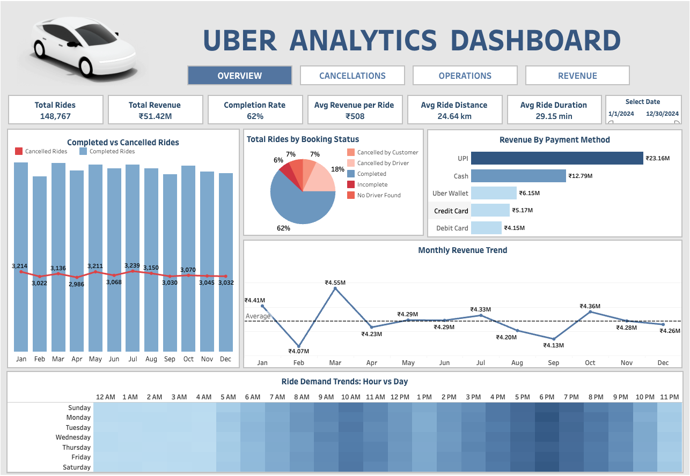

# Uber Ride Analytics - Complete Analysis Project

This project analyzes Uber ride cancellations using Tableau dashboards and machine learning models to identify operational patterns and estimate potential revenue recovery opportunities.

## Project Overview

This project demonstrates a complete analytics workflow from exploratory analysis to machine learning-based risk prediction.

**Two-Part Solution:**
1. **Tableau Dashboard** - Interactive visualizations for business insights (descriptive analytics)
2. **ML Prediction Model** - Random Forest classifier for proactive intervention (predictive analytics)

**Questions Answered:**
- What patterns drive ride cancellations?
- Can we predict high-risk bookings at request time?
- What is the potential business impact of reducing cancellations?

> Note: This project uses a public Kaggle dataset and is intended for educational and portfolio demonstration purposes only.
> Dataset size: ~148,000 ride records.

## Key Results

### Tableau Dashboard Insights
- **Total Revenue:** Rs. 51.4M across 148K rides
- **Completion Rate:** 62% (with breakdown of unsuccessful rides)
- **Average Revenue per Ride:** Rs. 508
- **Peak Performance:** Identified high-revenue zones and time periods

**[View Interactive Tableau Dashboard →](https://public.tableau.com/app/profile/disha.shetty5156/viz/UberAnalyticsDashboard_17653311088220/Overview)**

### Machine Learning Model
- **Model:** Random Forest Classifier
- **Problem Type:** Multi-class classification (5 ride outcomes)
- **Accuracy:** 71%
- **Macro F1-score: 0.39** (imbalanced dataset)

**Why Random Forest?**
- Performed best on minority classes
- Provides feature importance for business insights
- Stable performance without heavy tuning

### Revenue Impact Estimation

Based on model risk detection and realistic intervention assumptions:

| Intervention Scenario | Recovery Rate | Estimated Annual Recovery |
|-----------------------|---------------|---------------------------|
| Conservative | 20% | Rs. 1.6M |
| Moderate | 30% | Rs. 2.45M |
| Optimistic | 40% | Rs. 3.27M |

*Assumption: Revenue recovery estimates assume successful intervention on predicted high-risk bookings without negatively impacting completed ride volume.*

## Key Insights

- Payment method was the strongest predictor of cancellations
- Certain pickup/drop zones consistently showed higher risk
- Peak hours (evenings) had different cancellation behavior
- Minority classes (driver/customer cancellations) were harder to predict, highlighting operational complexity

## Tech Stack

**Data Visualization:**
- Tableau Public

**Machine Learning & Analysis:**
- Python 3.8+
- pandas, numpy (data processing)
- scikit-learn (machine learning)
- matplotlib, seaborn (visualization)
- Jupyter Notebook (development environment)

## Why This Project Matters

This project demonstrates the ability to:
- Translate business problems into measurable analytics questions
- Work with imbalanced operational data
- Communicate insights using Tableau dashboards
- Connect model outputs to business impact

## Contact

**Disha Shetty**
- LinkedIn: [https://www.linkedin.com/in/disha-shetty26/]

## Acknowledgments

- Dataset: Kaggle Uber Rides Dataset 2024

## License

This project is licensed under the MIT License - see the LICENSE file for details.
